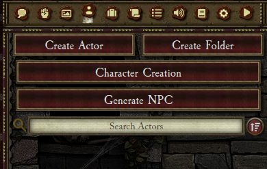
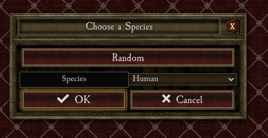
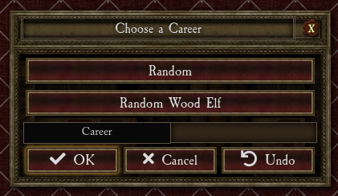
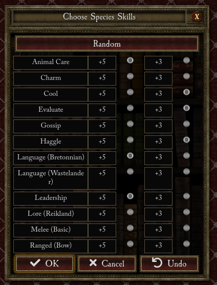
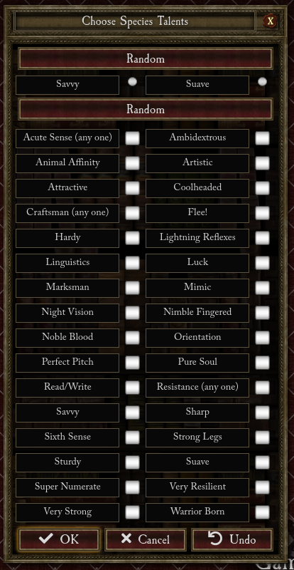
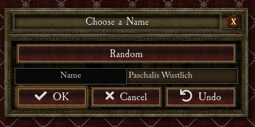
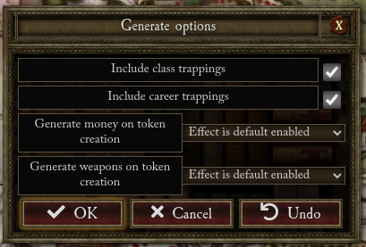
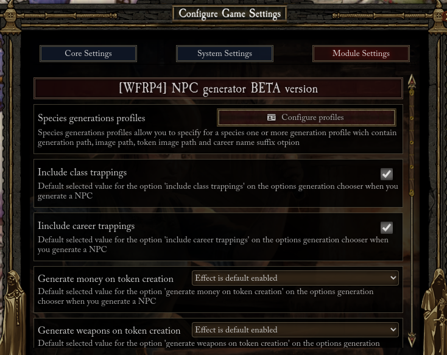
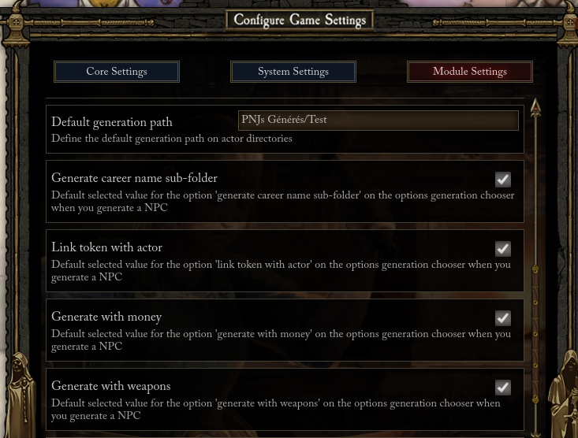
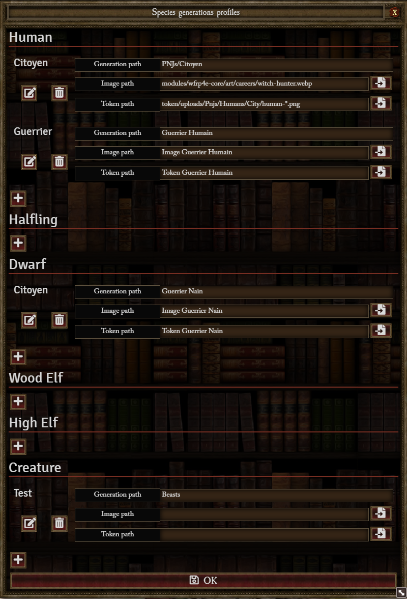

# WFRP 4 NPC generator

This module allow to generate npcs.

## Supported language

- EN
- FR
- DE (Not tested)

## System and dependencies

This module need the Warhammer Fantasy Roleplay 4e system and the wrfp4e-core module from C7

- System : https://foundryvtt.com/packages/wfrp4e
- wrfp4e-core : https://foundryvtt.com/packages/wfrp4e-core/

### Optional dependencies

For other language than English, if you want the generate NPC have his Native Tongue as Skill,
you have to install the translate module of wfrp4e-core and have the system language same as your translate module

- FR : https://gitlab.com/LeRatierBretonnien/foundryvtt-wh4-lang-fr-fr
- DE : https://github.com/StefanMasz/WFRP4e-de

## Usage

### From Actor Sidebar



#### 1 you choose a species



#### 2 you choose a career



#### 3 you choose the species skills



#### 4 you choose the species talents



#### 5 you choose a name



#### 6 you choose generation options



- Include class trappings : check it if you want to include class trapping on generated NPC
- Include career trappings : check it if you want to include career trapping (if founded) on generated NPC
- Generate money/weapons on token creation (see token generation rules below for detail) :
  - Don't include effect : NPC don't include the passive effect used to generate money/weapons on token creation
  - Effect is default disabled : NPC include the passive effect used to generate money/weapons on token creation, the effect is disabled
  - Effect is default enabled : NPC include the passive effect used to generate money/weapons on token creation, the effect is active
- Generate career name sub-folder : Check if you want to add to generation path the career group name as a sub-folder
- Link token with actor : Check if you want the generated NPC linked to his token (Passive generation effects are ignored in this case)
- Generate with money/weapon : Check if you want to include random money/weapons to the generated NPC (Passive generation effects are ignored in this case)
- Profile : Choose a species profile to pre-fill the following options :
  - Folder : The generation folders with '/' separator (ex : 'Generated NPC/Common'). All folders after the third are ignored
  - Image : The path for the generated NPC image
  - Token : The path for the generated NPC token image (random is set to true if a wilcard is present)

### From Macro

```
game.wfrp4e.npcGen.generateNpc((model, data, actor) => {
    console.dir(model) // The generating model
    console.dir(data)  // The initial Actor Data
    console.dir(actor) // The generated Actor
})
```

### Other macro Functions

#### Species Chooser

```
game.wfrp4e.npcGen.speciesChooser.selectSpecies(
    'human', // default selected speciesKey
    (speciesKey, speciesValue) => {
    console.dir(speciesKey)     // The chosen species key (string)
    console.dir(speciesValue)   // The choser species value (string)
})
```

#### career Chooser

```
game.wfrp4e.npcGen.careerChooser.selectCareer(
    'Advisor', // default selected Career
    'human', // The species key for get random career from species career table
    (career) => {
    console.dir(career)     // The chosen career Item
})
```

#### Species Skills Chooser

```
game.wfrp4e.npcGen.speciesSkillsChooser.selectSpeciesSkills(
    ['Ranged (Bow)', 'Melee (Basic)', 'Evaluate'], // The initial selected majors skill
    ['Gossip', 'Haggle', 'Cool'], // The initial selected minors skill
    'human', // The species key
    (majors, minors) => {
    console.dir(majors)     // The 3 chosen species skills for +5 (string[])
    console.dir(minors)     // The 3 chosen species skills for +3 (string[])
})
```

#### Species Talents Chooser

```
game.wfrp4e.npcGen.speciesTalentsChooser.selectSpeciesTalents(
    ['Suave', 'Flee!', 'Luck', 'Mimic'], // The initial selected talents
    'human', // The species key
    (talents) => {
    console.dir(talents)     // The chosen species talents (string[])
})
```

#### Name Chooser

```
game.wfrp4e.npcGen.nameChooser.selectName(
    'Default Name', // The initial selected name
    'human', // The species key
    (name) => {
    console.dir(name)     // The chosen name (string)
})
```

## Settings




- Settings allow you to define the default selected option of options chooser, the last step of NPC generation

### Create species profiles



- You can create profiles for each species to define :
  - Generation path : The generation folders with '/' separator (ex : 'Generated NPC/Common')
  - Image path : The path for the generated NPC image
  - Token path : The path for the generated NPC token image
- Profiles can be selected during the option chooser to pre-fill those fields

## Generation rules

- Actor is created with npc template (creature template comming soon)
- Actor have all his career skills, species skills, native tongue skill and basic skills
  - All career skills have 5 x career level advance
  - Majors species skill have 5 advance if not present in career
  - Minors species skill have 3 advance if not present in career
- Actor have all his career talent since the level 1 career and species talents
  - Only one advance by talent
  - Talent are added after Actor creation to attach effect
- Actor have adverage characteristic
  - Each characteristics have +/- 0-5
  - All career characteristics have 5 x career level advance
- If active, actor have all his class trappings
- If active and if items are found by equal or partial match, actor have all his career trappings
- If active, actor have an effect to indicate if you want to generate random money on token creation
- If active, actor have an effect to indicate if you want to generate random weapons, corresponding to you Melee or Ranged Skill, on token creation

## Token Generation rules


- All function fired during token generation work only if token is not link with actor data
- Those effect can be manualy created on existing NPC to activate this function, not only by the NPC generator

### Random money generation

If this effect is present and active on passive effect :

- en : "Generate money on token creation"
- fr : "Générer l'argent à la création du Token"

Money is added to token data during creation with this rules :

- Gold standing : tier x GC + 5D10 SS + 10D10 BP
- Silver standing : tier x 1D10 SS + 10D10 BP
- Brass standing : tier x 2D10 BP
- Money is finaly consolidate to have the fewest coins

### Random weapons generation

If this effect is present and active on passive effect :

- en : "Generate weapons on token creation"
- fr : "Générer des armes à la création du Token"

Weapons are added to token data during creation with this rules :

- One random weapon per each Melee or Ranged Skills, Two weapons for Melee (Basic), existing actor weapons are counting to determinate if a new weapon is generate
- Melee (any) and Ranged (any) are replaced by a random other group and a weapon is generate
- For Ranged, a random ammunition for this weapon is added with a minimum quantity of 10 (apply for existing weapon, not only the generated ones)

## Comming soon

- Add Gnome if rnhd module is present
- Create a simpliest generator with creature template
- Allow to select many careers to create a career path instead of de automatic career path
- create a chat command
- Manage other language

## Module link

https://raw.githubusercontent.com/mcailleaux/WFRP4-FoundryVTT-wfrp4e-npc-generator/dist/module.json

## Module Beta link

https://raw.githubusercontent.com/mcailleaux/WFRP4-FoundryVTT-wfrp4e-npc-generator/dist-beta/module-beta.json
