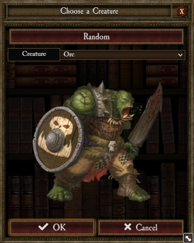
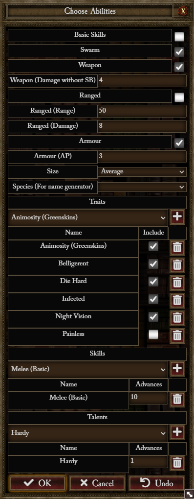
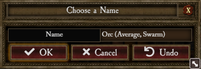
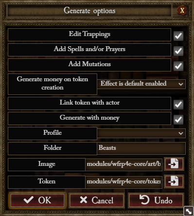

# Creature Generator Usage

## From Actor Sidebar


### 1 you choose an existing creature template



### 2 you choose creature abilities



- All abilities are initialised with the values from selected template

### 3 you choose a name



### 4 you choose generation options



- Edit Trappings : check it if you want to add/remove trappings before generation
- Add Spells and/or Prayers : check it if you want to add/remove spells and or prayers before generation
- Add Mutations : check it if you want to add/remove mutations before generation
- Generate money on token creation (see token generation rules below for detail) :
  - Don't include effect : Creature don't include the passive effect used to generate money on token creation
  - Effect is default disabled : Creature include the passive effect used to generate money on token creation, the
    effect is disabled
  - Effect is default enabled : Creature include the passive effect used to generate money on token creation, the effect
    is active
- Link token with actor : Check if you want the generated Creature linked to his token (Passive generation effects are
  ignored in this case)
- Generate with money : Check if you want to include random money to the generated Creature (Passive generation effects
  are ignored in this case)
- Profile : Choose a creature profile to pre-fill the following options :
  - Folder : The generation folders with '/' separator (ex : 'Generated Creature/Common'). All folders after the third
    are ignored
  - Image : The path for the generated Creature image
  - Token : The path for the generated Creature token image (random is set to true if a wildcard is present)

### 5 (optional) you add/remove trappings


### 6 (optional) you add/remove spells and/or prayers


### 7 (optional) you add/remove mutations


## From Macro

```
game.wfrp4e.creatureGen.generateCreature((model, data, actor) => {
    console.dir(model) // The generating model
    console.dir(data)  // The initial Actor Data
    console.dir(actor) // The generated Actor
})
```
