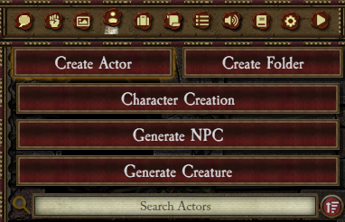
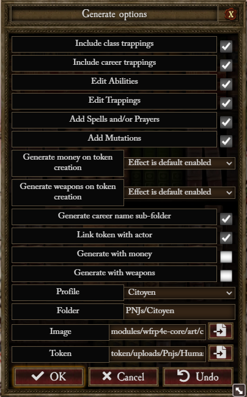
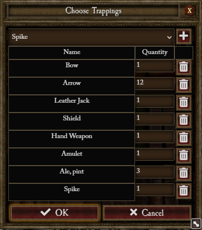
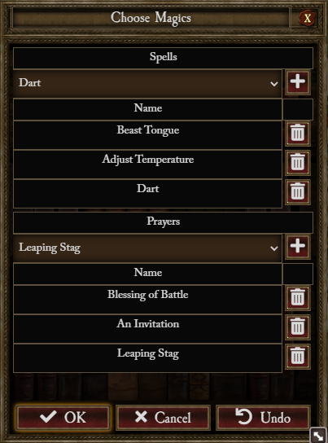
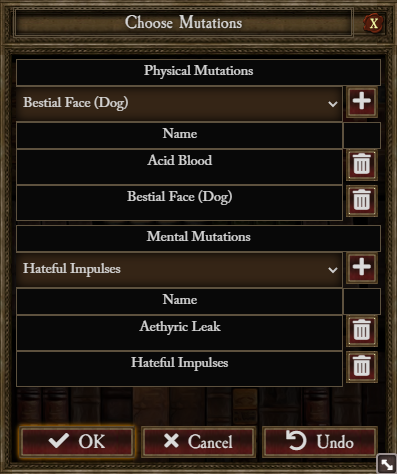

# NPC Generator Usage

## From Actor Sidebar



### 1 you choose a species


### 2 you choose a career


### 3 you choose the species skills


### 4 you choose the species talents


### 5 you choose a name


### 6 you choose generation options



- Include class trappings : check it if you want to include class trapping on generated NPC
- Include career trappings : check it if you want to include career trapping (if founded) on generated NPC
- Edit Trappings : check it if you want to add/remove trappings before generation
- Add Spells and/or Prayers : check it if you want to add/remove spells and or prayers before generation
- Add Mutations : check it if you want to add/remove mutations before generation
- Generate money/weapons on token creation (see token generation rules below for detail) :
  - Don't include effect : NPC don't include the passive effect used to generate money/weapons on token creation
  - Effect is default disabled : NPC include the passive effect used to generate money/weapons on token creation, the
    effect is disabled
  - Effect is default enabled : NPC include the passive effect used to generate money/weapons on token creation, the
    effect is active
- Generate career name sub-folder : Check if you want to add to generation path the career group name as a sub-folder
- Link token with actor : Check if you want the generated NPC linked to his token (Passive generation effects are
  ignored in this case)
- Generate with money/weapon : Check if you want to include random money/weapons to the generated NPC (Passive
  generation effects are ignored in this case)
- Profile : Choose a species profile to pre-fill the following options :
  - Folder : The generation folders with '/' separator (ex : 'Generated NPC/Common'). All folders after the third are
    ignored
  - Image : The path for the generated NPC image
  - Token : The path for the generated NPC token image (random is set to true if a wildcard is present)

### 7 (optional) you add/remove trappings



### 8 (optional) you add/remove spells and/or prayers



### 9 (optional) you add/remove mutations



## From Macro

```
game.wfrp4e.npcGen.generateNpc((model, data, actor) => {
    console.dir(model) // The generating model
    console.dir(data)  // The initial Actor Data
    console.dir(actor) // The generated Actor
})
```
