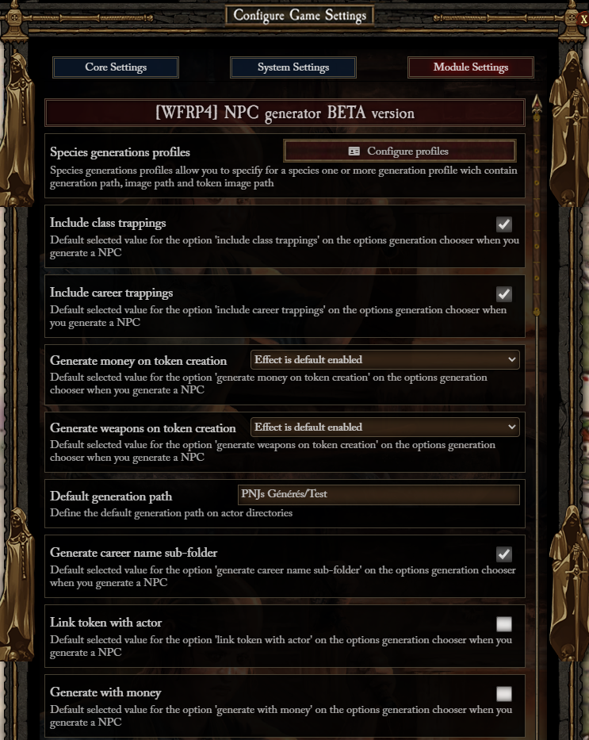
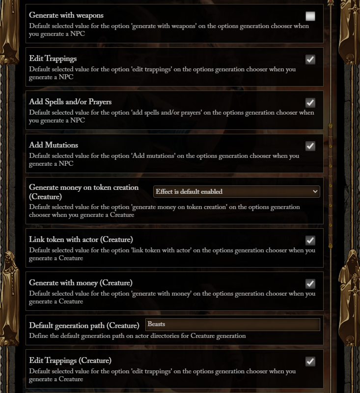
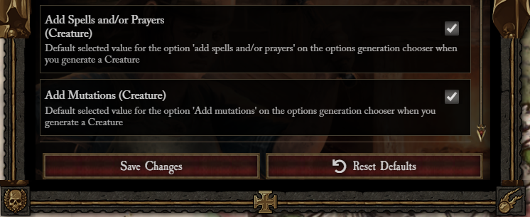

# Settings

- Settings allow you to define the default selected option of options chooser, the last step of NPC or Creature
  generation

## Create species profiles

- You can create profiles for each species to define :
  - Generation path : The generation folders with '/' separator (ex : 'Generated NPC/Common')
  - Image path : The path for the generated NPC image
  - Token path : The path for the generated NPC token image
- Profiles can be selected during the option chooser to pre-fill those fields
- You can create profiles for creatures
